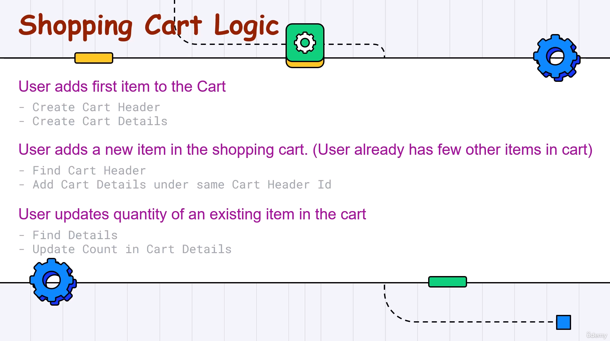

# Estudos Microsserviços

### Projeto para estudos de Microsserviços

Criação de Microsserviços, seguindo padrões e boas práticas.  
Padrão feito a partir de vários tutoriais e estruturas que achei interessante.  
Baseado no curso '.NET Core Microservices - The Complete Guide (.NET 8 MVC)', disponibilizado na Udemy por Bhrugen Patel:
 
https://www.udemy.com/course/net-core-microservices-the-complete-guide-net-6-mvc/

Vídeo do curso na versão de graça:
 
https://www.youtube.com/watch?v=Nw4AZs1kLAs
 

Obs.: cada projeto de serviço seguiu uma estrutura simples, pois o objetivo é o estudo do padrão de microsserviços.
 
 

---
### Histórico branches (em implementação):

Arquitetura utilizada para este projeto:
</img>
- Linhas contínuas são comunicações síncronas
  - Exemplo: o ShoppingCartAPI precisa requisitar os detalhes dos Produos para o ProductsAPI, esperar o retorno, para depois enviar as informações para o frontend.
- Linhas tracejadas são comunicações assíncronas
  - Exemplo: quando requisitado o serviços de enviar email, no EmailAPI, não é esperado um retorno, apenas é solicitada a ação.

#### Anotações:
- Como ocorre a autenticação no MVC:
  1. Usuário faz o cadastro;
  2. Usuário faz login;
  3. No processo de login, o token que é retornado na resposta é armazenado em cookie (TokenProvider);
  4. Nas requisições que necessitam de autenticação, o token é adquirido pelo cookie (TokenProvider) e adicionado no header pelo BaseService (que é onde está implementado todas as requisições HTTP);

 

- Como ocorre a autenticação entre serviços (exemplo no ShoppingCartAPI):
  1. Após receber uma requisição com o token, vinda do projeto MVC, este token é armazenado pelo BackendApiAuthenticationHttpClientHandler;
  2. Toda requisição feita entre serviços é configurada para que este token seja adicionado.

 

- Não confundir o 'async' e 'await' que utilizamos em métodos, com os tipos de comunicações 'async' e 'sync'. Métodos com 'async' e 'await' servem para que a execução do código espere o retorno de algo que está como await, para que então continue. Comunicação 'sync' e 'async' é o que foi explicado abaixo da imagem (no desenho da arquitetura com as linhas contínuas e tracejadas).

 

Lógica para implementação do carrinho de compras (ShoppingCart):

</img>

 

---
### Histórico branches (em implementação):

1 - CouponAPI

<ul>
  <li>Implementado estrutura base com projetos e pastas;</li>
  <li>Implementado API para Coupon;</li>
</ul> 

2 - AuthAPI

<ul>
    <li>Implementado API para Auth;</li>
    <li>Implementado autenticação com Token JWT.</li>
</ul> 

3 - ProductAPI

<ul>
    <li>Implementado API para Product.</li>
</ul> 

4 - Homepage e Details

<ul>
  <li>Implementado view da Homepage com cards de Products e a view de Details para detalhes do produto com botão de adicionar no carrinho.</li>
</ul> 

5 - Shopping Cart

<ul>
  <li>Implementado API para ShoppingCart.</li>
</ul> 

6 - Service Bus

<ul>
  <li></li>
</ul> 

7 - Email API

<ul>
  <li></li>
</ul> 

8 - Checkout e OrderAPI

<ul>
  <li></li>
</ul> 

9 - RewardsAPI

<ul>
  <li></li>
</ul> 

10 - Gateway

<ul>
  <li></li>
</ul> 

---

### Estudos (com links para referência):

O que é ASP.NET?

https://dotnet.microsoft.com/pt-br/learn/aspnet/what-is-aspnet

Vídeo: Microservice ASP.NET CORE Example

https://www.youtube.com/watch?v=6grbaE9fnUU

Vídeo: Redis + Microservices Architecture in 60 Seconds

https://www.youtube.com/watch?v=Su5l3XtimLw

Vídeo: Redis Crash Course - the What, Why and How to use Redis as your primary database

https://www.youtube.com/watch?v=OqCK95AS-YE

Vídeo: Why should you use Kafka in your microservice applications?

https://www.youtube.com/watch?v=cv5vqi5O9bY

ASP.NET Razor Pages vs MVC: How Do Razor Pages Fit in Your Toolbox?

https://stackify.com/asp-net-razor-pages-vs-mvc/

The API gateway pattern versus the Direct client-to-microservice communication

https://learn.microsoft.com/en-us/dotnet/architecture/microservices/architect-microservice-container-applications/direct-client-to-microservice-communication-versus-the-api-gateway-pattern

Microservices: REST vs Messaging

https://stackoverflow.com/questions/41010290/microservices-rest-vs-messaging

Rest API vs AMQP

https://stackoverflow.com/questions/59478191/rest-api-vs-amqp

Building a Microservices Ecosystem with Kafka Streams and KSQL

https://www.confluent.io/blog/building-a-microservices-ecosystem-with-kafka-streams-and-ksql/

Tutorial: Introduction to Streaming Application Development

https://docs.confluent.io/platform/current/tutorials/examples/microservices-orders/docs/index.html

